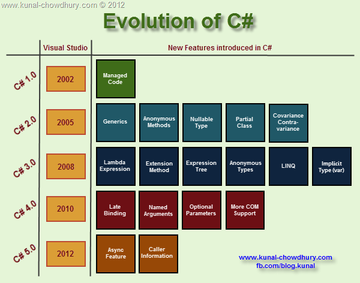

### News

 - [Linux creator Linus Torvalds doesn't really care about open source](http://www.techrepublic.com/article/linux-creator-linus-torvalds-doesnt-really-care-about-open-source/#ftag=RSS56d97e7)
 - [How to use Chrome Extensions to bypass Paywalls](http://elaineou.com/2016/02/19/how-to-use-chrome-extensions-to-bypass-paywalls)
 - [How to Safely Store Your Users' Passwords in 2016](https://paragonie.com/blog/2016/02/how-safely-store-password-in-2016)
 - [HoloLens shipping March 30](https://blogs.windows.com/devices/2016/02/29/announcing-microsoft-hololens-development-edition-open-for-pre-order-shipping-march-30/)
 - [Visual Studio Code for Go](https://github.com/Microsoft/vscode-go)
  - HN Comment: "my team writes in a lang created by Google in an editor created by Microsoft on System76 laptops running Ubuntu"
 - [The Internet demands a pile of poo from Mads Torgersen!](https://twitter.com/xjoeduffyx/statuses/705125379258777600)
 
### Mads Torgersen

Mads Torgersen is a Program Manager for the C# Programming Language. He runs the C# language design process and maintains the language specification.

 - [@MadsTorgersen](https://twitter.com/MadsTorgersen)
 - [Channel9 Profile](https://channel9.msdn.com/Events/Speakers/Mads-Torgersen)
 - [MSDN Blog](http://blogs.msdn.com/b/madst/)
 
 ------------------------------------
 
 - [C# 7 Working list](https://github.com/dotnet/roslyn/issues/2136)

### Dev Tip of the Week

 - [JustDecompile](http://www.telerik.com/products/decompiler.aspx)