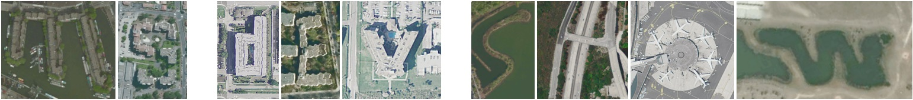

### News

 - [Make HTML Great Again](https://medium.com/track-changes/track-changes-podcast-3-make-html-great-again-66dbd5ecfd46#.qukvs6m8c)
 - [Falsehoods Programmers Believe About Phone Numbers](https://github.com/googlei18n/libphonenumber/blob/master/FALSEHOODS.md?utm_content=buffer8232f&utm_medium=social&utm_source=twitter.com&utm_campaign=buffer)
 - [Microsoft Azure and Amazon Web Services](https://azure.microsoft.com/en-us/campaigns/azure-vs-aws/mapping/)
 - [Aerial Bold Font](http://type.aerial-bold.com/tw/)
  - 
 - [Please Scan My Towel](http://jerrygamblin.com/2016/03/01/please-scan-my-towel/)
 
### Matt Long

Matt Long is a Technical Evangelist in DX and Co-Founder of The Pegasus Mission.

 - [LinkedIn](https://www.linkedin.com/in/matt-long-56b5996)
 - [Channel 9](https://channel9.msdn.com/Events/Speakers/matt+long)

---------------------------------------------

 - [@PegasusMission](https://twitter.com/PegasusMission)
 - [pegasusmission.io](https://www.pegasusmission.io/)
 - [pegasusmission.com](http://pegasusmission.com/)
  - [Pegasus Mission – Prequel](http://pegasusmission.com/2015/02/09/pegasus-mission-prequel/)
 - [Windows App](https://www.microsoft.com/en-us/store/apps/pegasus-mission/9nblggh5x13r)

### Azure pick of the week

 - [Announcing SQL Server on Linux](https://blogs.microsoft.com/blog/2016/03/07/announcing-sql-server-on-linux/)

### Dev Tip of the Week

 - [Windows Store Affiliate Links](https://blogs.windows.com/buildingapps/2016/03/15/using-the-microsoft-affiliate-program-to-earn-additional-7-on-windows-store-sales/)
