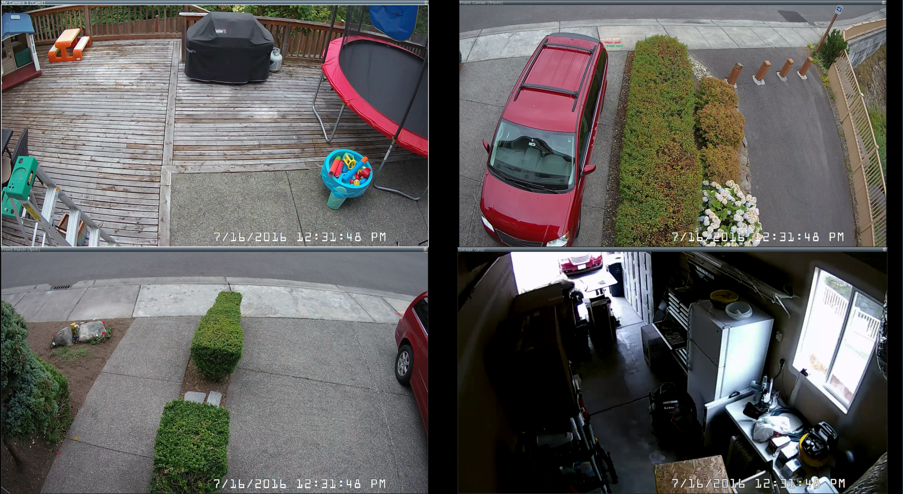
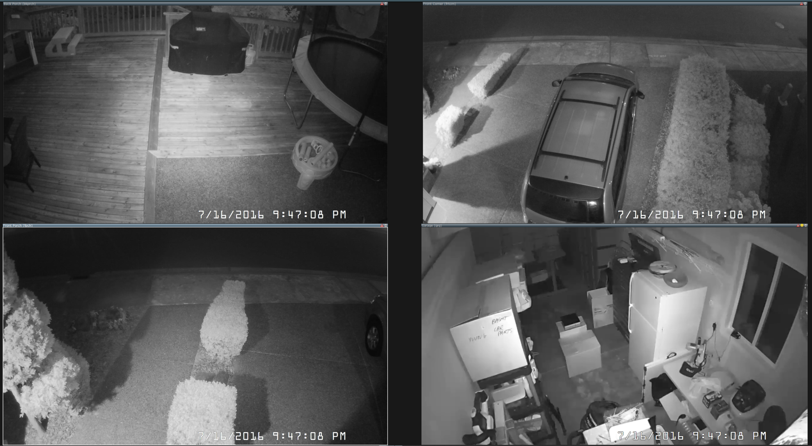

### News

 - [Building a BitTorrent client from scratch in C#](https://cheatdeath.github.io/research-bittorrent-doc/)
 - [Software has diseconomies of scale - not economies of scale](http://allankelly.blogspot.com/2015/10/software-has-diseconomies-of-scale-not.html)
 - [How becoming a pilot made me a better programmer](http://nathanmarz.com/blog/how-becoming-a-pilot-made-me-a-better-programmer.html)
 - [Self-care matters: Pay yourself first](http://www.hanselman.com/blog/SelfcareMattersPayYourselfFirst.aspx)
 - Security cameras?
  - [Hikvision DS-2CD2042WD-I](http://amzn.to/29GVBQf) $114
  - [TP-Link PoE Switch](http://amzn.to/2antDGo) $47
  - [Blue Iris Software](http://blueirissoftware.com/) $60
  - [Ethernet Cable](http://www.monoprice.com/product?c_id=102&cp_id=10233&cs_id=1023303&p_id=877&seq=1&format=2) $81
  - 
  - 
  - 

### Dev Tips of the Week

 - Open a code file on the OneDrive website and be amazed. Cloud storage with intellisense!
 - [UWP UI basics (XAML) sample](https://github.com/Microsoft/Windows-universal-samples/tree/master/Samples/XamlUIBasics)
 - [Continuous - C# and F# IDE for the iPad](http://praeclarum.org/post/147003028753/continuous-c-and-f-ide-for-the-ipad)
 
### Lori Lalonde 

 - [@loriblalonde](https://twitter.com/loriblalonde)
 - [Western Devs Podcast](http://www.westerndevs.com/)
 - [Blog](http://geekswithblogs.net/lorilalonde/Default.aspx)
 - [MVP Page](https://mvp.microsoft.com/en-us/mvp/Lori%20Lalonde-5000647)
 - [CTTDNUG](http://www.meetup.com/CTTDNUG/)
 - [Amazon Book](http://www.amazon.com/Windows-Phone-Recipes-Problem-Solution-Approach/dp/1430259027/ref=la_B00J4U0A4I_1_1?s=books&ie=UTF8&qid=1427487378&sr=1-1)

---------------------------------------------------------------------

 - [Xamarin Evlolve Speaker Spotlight](https://blog.xamarin.com/xamarin-evolve-2016-speaker-spotlight-lori-lalonde/)
 - [Extending Views and Adding Custom Attributes in Your Xamarin.Android App](https://evolve.xamarin.com/session/56e20ae5bad314273ca4d819)
 - [Globalization and localization do's and don'ts](https://msdn.microsoft.com/en-us/windows/uwp/globalizing/guidelines-and-checklist-for-globalizing-your-app)
 - [ResX Manager](https://visualstudiogallery.msdn.microsoft.com/3b64e04c-e8de-4b97-8358-06c73a97cc68)
 - [Multilingual app toolkit](https://developer.microsoft.com/en-us/windows/develop/multilingual-app-toolkit)
 - [What's Wrong With Turkey?](https://blog.codinghorror.com/whats-wrong-with-turkey/)
 - [Cross Platform Localization Strategies](http://www.slideshare.net/LoriLalonde/cross-platform-localization-strategies-56225783)
