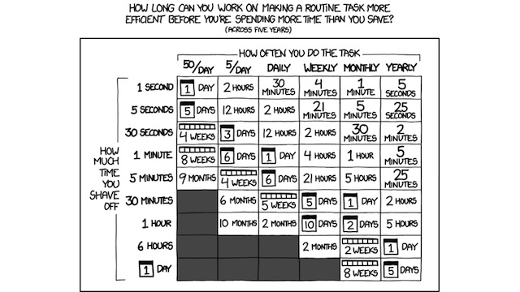

Join us for the [MS Dev Show Meetup at the MVP Summit](http://msdevshow.com/meetup-at-mvp-summit-2016/)!

### News

 - [Windows 10 will soon run Edge in a virtual machine to keep you safe](http://arstechnica.com/information-technology/2016/09/windows-10-will-soon-run-edge-in-a-virtual-machine-to-keep-you-safe/)
 - [IoT Standards Groups OCF, AllSeen Alliance Merge](http://www.eweek.com/networking/iot-standards-groups-ocf-allseen-alliance-merge.html)
 - [youmightnotneedjs.com](http://youmightnotneedjs.com/)
 - [Yammer is dead… Long live Yammer!](http://betanews.com/2016/09/29/microsoft-kills-yammer-enterprise/)
 - [Google to desktop owners: You're about to get staler search results than mobile users](http://www.zdnet.com/article/google-to-desktop-owners-youre-about-to-get-staler-search-results-than-mobile-users/)
 - [Soylentember](http://codefoster.com/soylent/)

### Jeremy Foster

Jeremy Foster, also known as Code Foster, is a Developer Evangelist at Microsoft, he frequents many meetups, and produces amazing content on a steady basis.

 - [@codefoster](https://twitter.com/codefoster)
 - [codefoster.com](http://codefoster.com)
 - [codefoster.com/better](http://codefoster.com/better)
  - [hexo.io](https://hexo.io/)
 - [Code Chat](http://codefoster.com/codechat)
 
-------------------------------------------------

 - [DarnMouse](http://codefoster.com/darnmouse)
 - [Going Commando - Put Down The Mouse](https://blog.codinghorror.com/going-commando-put-down-the-mouse/)

-------------------------------------------------

 - [Code Writers Workshop](https://www.modev.com/code-writers-workshop-seattle)
 - [KeyHero - Create your own Typing Test](https://www.keyhero.com/custom-typing-test/)
 - [emmet.io](http://emmet.io/)
 - [Editing Evolved](http://code.visualstudio.com/docs/editor/editingevolved)
 - [SpaceMouse](http://www.3dconnexion.com/products/spacemouse.html)
 - 
 
### Dev Tips of the Week

 - [Reset Windows Graphics stack Win+Ctrl+Shift+B](https://twitter.com/mahoekst/status/786793407049936897)
 - [Share Chrome with others or add personas](https://support.google.com/chrome/answer/2364824?hl=en&ref_topic=3421437)
 - [localtunnel](https://github.com/localtunnel/localtunnel)
  - [ngrok](https://ngrok.com/)