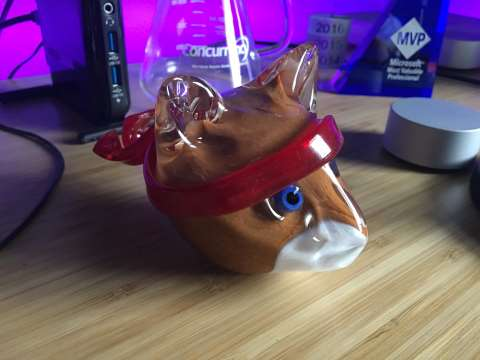

### News

 - [Dutch Police To Start Using Microsoft HoloLens Headset](http://www.androidheadlines.com/2016/12/dutch-police-start-using-microsoft-hololens-headset.html)
 - [TypeScript 2.1](https://blogs.msdn.microsoft.com/typescript/2016/12/07/announcing-typescript-2-1/)
 - [Mac users switching to Surface more than ever before, after new MacBook Pro ‘disappointment’](https://9to5mac.com/2016/12/12/macbook-pro-disappointment-switching-surface/)
   - [Lemmings on the MacBook Pro TouchBar](http://gizmodo.com/playing-lemmings-on-the-macbook-pros-touch-bar-almost-j-1789995481)

### Chris Wilcox

This week we have Chris Wilcox. He is a developer on Azure Notebooks. His team at Microsoft also ships the [Python Tools for Visual Studio](https://microsoft.github.io/PTVS/) and the [Azure SDK for Python](https://azure-sdk-for-python.readthedocs.io/en/latest/index.html).

 - [@chriswilcox47](https://twitter.com/chriswilcox47)
 - [crwilcox.com](http://crwilcox.com/)
 - [GitHub](https://github.com/crwilcox)

-----------------------------------------------------

 -  [Python Tools for Visual Studio](https://microsoft.github.io/PTVS/)
 -  [GitHub](https://github.com/Microsoft/PTVS)
 -  [Microsoft Azure Machine Learning Studio](https://studio.azureml.net/)
 -  [Python Engineering at Microsoft Blog](https://blogs.msdn.microsoft.com/pythonengineering/)

-----------------------------------------------------

 - [jupyter](http://jupyter.org/)
 - [LIGO Open Data Notebook](https://notebooks.azure.com/library/LIGOOpenScienceCenter)
 - [Deep Learning Made Easy in Azure](https://blogs.technet.microsoft.com/machinelearning/2016/11/28/deep-learning-made-easy-in-azure/)

-----------------------------------------------------
 
-   

### Dev Tip of the Week

 - [VS Code Compare](http://dailydotnettips.com/2015/06/04/how-to-compare-files-in-visual-studio-code/)
   - [Doesn't work with unsaved files](https://github.com/Microsoft/vscode/issues/14501)