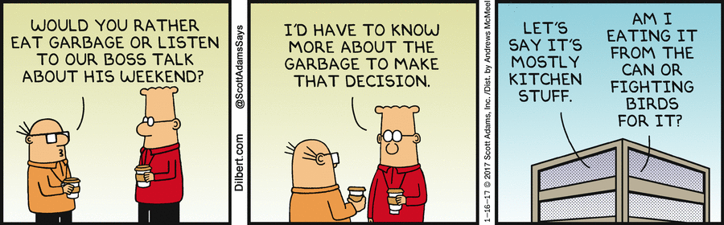

---
layout: post
title: .Net Multi-Targeting
guest: Oren Novotny
guestImage: oren-novotny.jpg
date: 2017-01-27
audioUrl: https://traffic.libsyn.com/msdevshow/msdevshow_0137.mp3
ch9Url: https://channel9.msdn.com/Shows/msdevshow/Episode-137-NET-Multi-targeting-with-Oren-Novotny
--- 

### News

 - [Top 20 Developer Tools of 2016](https://blog.axosoft.com/2016/12/29/top-20-developer-tools-2016)
 - [Introducing a new Markdown View Engine for ASP.NET Core](http://www.hishambinateya.com/introducing-a-new-markdown-view-engine-for-asp.net-core)
 - [CES 2017: Intel Unveils a Credit Card-Sized Computer](https://www.thurrott.com/hardware/88336/ces-2017-intel-unveils-credit-card-sized-computer)
    - [Intel Unveils Compute Card, a Credit Card-Sized Compute Platform](https://newsroom.intel.com/news/intel-unveils-intel-compute-card-credit-card-sized-compute-platform/)
 - [The Infrastructure Behind Twitter: Scale](https://blog.twitter.com/2017/the-infrastructure-behind-twitter-scale)
 - [Grace Hopper and the psychological drain on the gender minority](https://medium.com/code-like-a-girl/grace-hopper-and-the-psychological-drain-on-the-gender-minority-be3ff348f2ff#.rmuampncw)
 - [iPhone 7 Plus - Technical Specifications](https://support.apple.com/kb/SP744?viewlocale=en_US&locale=en_US)
 
### Oren Novotny

Oren is a Microsoft and Xamarin MVP and a Principal Architect at the consulting company, Blue Metal. He has many years experience in creating .Net applications and advises many internal Microsoft teams on developer experiences.

 - [@onovotny](https://twitter.com/onovotny)
 - [oren.codes](https://oren.codes/)
 - [GitHub](https://github.com/onovotny)
 - [LinkedIn](https://www.linkedin.com/in/orennovotny)
 - [Microsoft MVP](https://mvp.microsoft.com/en-us/PublicProfile/5000913)
 - [Xamarin MVP](https://www.xamarin.com/mvp)
 - [Blue Metal](https://www.bluemetal.com/Team/Novotny-Oren)

------------------------------------------------------------------------

 - [Multi-targeting the world: a single project to rule them all](https://oren.codes/2017/01/04/multi-targeting-the-world-a-single-project-to-rule-them-all/)
 - [Using MSBuild and Team Foundation Build](https://www.amazon.com/Inside-Microsoft-Build-Engine-Foundation-ebook/dp/B00JDMPDLM/ref=la_B002BM214I_1_1?s=books&ie=UTF8&qid=1485468188&sr=1-1)

### Azure Pick of the Week

 - [Azure functions - TypeScript coming soon!](https://twitter.com/ytechie/status/824312159597268992)

### App of the Week

 - [LightBlue Explorer - Bluetooth Low Energy](https://itunes.apple.com/us/app/lightblue-explorer-bluetooth/id557428110?mt=8)

### Dev Tip of the Week

 - [How to shutdown a Windows 10 IoT Core device from a UWP app](https://marcominerva.wordpress.com/2016/12/13/how-to-shutdown-a-windows-10-iot-core-device-from-a-uwp-app/)

### Question Of the Week (the card game one)

