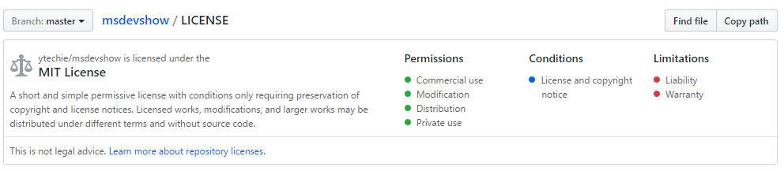

---
layout: post
title: stdlib, Nodal, NtSeq, and the Future of FaaS
guest: Keith Horwood
guestImage: keith-horwood.jpg
date: 2017-03-28
audioUrl: https://traffic.libsyn.com/msdevshow/msdevshow_0144.mp3
ch9Url: https://channel9.msdn.com/Shows/msdevshow/Episode-144-stdlib-Nodal-NtSeq-and-the-Future-of-FaaS-with-Keith-Horwood
--- 

### News

 - [Ergotron Tall-User Kit](https://www.amazon.com/gp/product/B00M1BV46K/)
 - [Enhanced open source license descriptions and metadata](https://github.com/blog/2335-open-source-license-descriptions-and-metadata)
    

 - [Github Contribution Mug](https://github.myshopify.com/products/contribution-mug)
 - [Google App Engine Adds .NET Support As It Races to Be The PaaS of Choice](https://www.programmableweb.com/news/google-app-engine-adds-net-support-it-races-to-be-paas-choice/analysis/2017/03/14?platform=hootsuite)
 - [StackOverflow Developer Survey Results 2017!!!!](https://stackoverflow.com/insights/survey/2017/)
 - [VS Code Uses 13% CPU When Idle Due to Blinking Cursor Rendering](https://www.reddit.com/r/programming/comments/612v99/vs_code_uses_13_cpu_when_idle_due_to_blinking/)
   - [VS Code GitHub Issue](https://github.com/Microsoft/vscode/issues/22900)

### Keith Horwood

Keith is the founder of [stdlib](http://stdlib.com/) and author of the API framework [Nodal](http://www.nodaljs.com/)

  - [@keithwhor](https://twitter.com/keithwhor)
  - [@StdLibHQ](https://twitter.com/StdLibHQ)
  - [GitHub](https://github.com/keithwhor)
  - [keithwhor.com](http://www.keithwhor.com/)

-------------------------------------------------------------------

 - [stdlib.com](http://stdlib.com/)
 - [nodaljs.com](http://www.nodaljs.com/)

###  App of the Week

 - [IotHub Device Explorer on GitHub](https://github.com/Azure/azure-iot-sdk-csharp/tree/master/tools/DeviceExplorer)

### Dev Tip of the Week

 - [IotHub Device Explorer on  GitHub](https://github.com/Azure/azure-iot-sdk-csharp/tree/master/tools/DeviceExplorer)
