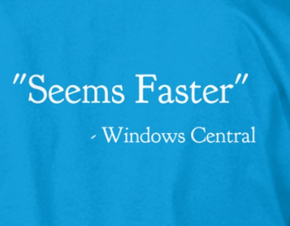

---
layout: post
title: Mobile Center
guest: Simina Pasat and Karl Piteira
guestImage: simina-and-karl.jpg
date: 2017-04-11
audioUrl: https://traffic.libsyn.com/msdevshow/msdevshow_0146.mp3
ch9Url: https://channel9.msdn.com/Shows/msdevshow/Episode-146-Mobile-Center-with-Simina-Pasat-and-Karl-Piteira
--- 
 
### News

 - [Announcing custom domain HTTPS support with Azure CDN](https://azure.microsoft.com/en-us/blog/announcing-custom-domain-https-support-with-azure-cdn/)
 - [Announcing the .NET Framework 4.7](https://blogs.msdn.microsoft.com/dotnet/2017/04/05/announcing-the-net-framework-4-7/)
 - [Project Scorpio specs](http://www.xbox.com/en-us/project-scorpio)
 - Creators update is out, sort of 
   - Internet sharing
   - Quiet hours can be 18 hours now
   - Built-in f.lux

 

### Guests

Simina Passat and Karl Peteira Program managers for mobile center, Siminia is focused on Devops and karl is focused on monitoring 

### Simina Pasat

 - [@siminapasat](https://twitter.com/siminapasat)
 - [simina.eu](http://www.simina.eu/)
 - [GitHub](https://github.com/siminapasat)
 - [LinkedIn](https://www.linkedin.com/in/simina-pasat-5707a633/)

-----------------------------------------------------

### Karl Piteira

 - [@twikarl](https://twitter.com/twikarl?lang=en)
 - [LinkedIn](https://www.linkedin.com/in/karlpiteira/)
 - [Channel9](https://channel9.msdn.com/Events/Speakers/karl-piteira)

------------------------------------------------------

-   [Visual Studio Mobile Center](https://www.visualstudio.com/vs/mobile-center/)
-   [Welcome to Mobile Center](https://docs.microsoft.com/en-us/mobile-center/)
-   [Mobile Center Product Roadmap](https://docs.microsoft.com/en-us/mobile-center/general/roadmap)
-   [Mobile Center Portal](https://mobile.azure.com/login)

### Azure Pick of the Week

 - [Azure Stack Technical Preview 3 refresh with Azure PaaS services](https://azure.microsoft.com/en-us/blog/azure-stack-technical-preview-3-refresh-with-azure-paas-services/)
