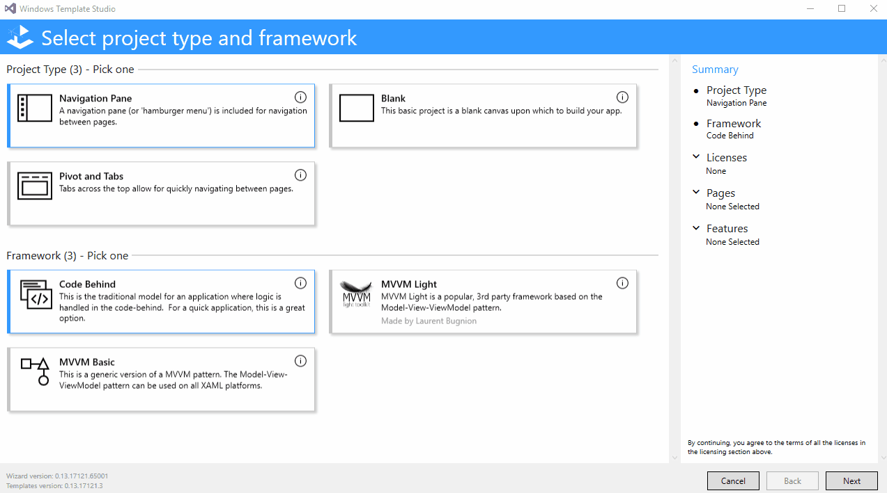

---
layout: post
title: Windows Template Studio
guest: Clint Rutkas and Michael Crump
guestImage: clint-and-michael.jpg
date: 2017-05-31
audioUrl: https://traffic.libsyn.com/msdevshow/msdevshow_0154.mp3
ch9Url: https://channel9.msdn.com/Shows/msdevshow/Episode-154-Windows-Template-Studio-with-Clint-Rutkas-and-Michael-Crump
--- 

### Build 2017

This episode on Windows Template Studio concludes our exclusive coverage of the highlights from Build 2017 in Seattle Washington.

### Clint Rutkas

Clint is a Technical Product Manager at Microsoft that helps looks after the Universal Windows Platform.

 - [@ClintRutkas](https://twitter.com/ClintRutkas)
 - [LinkedIn](https://www.linkedin.com/in/clintrutkas/)
 - [GitHub](https://github.com/crutkas)

### Michael Crump

Michael is a Technical Product Manager at Microsoft that helps looks after the Universal Windows Platform.

 - [@mbcrump](https://twitter.com/mbcrump)
 - [michaelcrump.net](http://michaelcrump.net/)
 - [LinkedIn](https://www.linkedin.com/in/mbcrump/)
 - [GitHub](https://github.com/mbcrump)

### Windows Template Studio

 - [Windows Template Studio](http://aka.ms/wts)
 - [WTS at Build](https://channel9.msdn.com/Events/Build/2017/C9L12)
 - [Announcing Windows Template Studio](https://blogs.windows.com/buildingapps/2017/05/16/announcing-windows-template-studio/)
