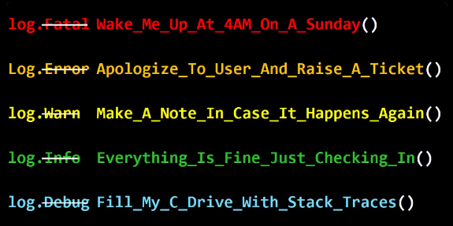

---
layout: post
episodeNumber: 162
title: Fluent Design
guest:  James Clarke
guestImage:  james-clarke.jpg
date: 2017-07-25
audioUrl: https://traffic.libsyn.com/msdevshow/msdevshow_0162.mp3
--- 

### News

 - [27,000 Errors in the Tizen Operating System](https://www.viva64.com/en/b/0519/)
    - [We Continue Exploring Tizen: C\# Components Proved to be of High Quality](https://www.viva64.com/en/b/0521/)
    - [Bugfest! Win2000 has 63,000 'defects'](http://www.zdnet.com/article/bugfest-win2000-has-63000-defects/)
-   [What logging levels really mean](https://twitter.com/dylanbeattie/status/887655408239869952)
    -   
-   [List of Internet top-level domains](https://en.wikipedia.org/wiki/List_of_Internet_top-level_domains)
-   [NETDUINO IS BACK!](http://blog.wildernesslabs.co/netduino-is-back/)
-   [What we’ve learned from .NET Core SDK Telemetry](https://blogs.msdn.microsoft.com/dotnet/2017/07/21/what-weve-learned-from-net-core-sdk-telemetry/)

### James Clarke

This week we have James Clarke. He is a Lead Program Manager on the Windows UI Platform team where he works on the Effects and Animation engine that powers Microsoft's new Fluent Design System.  James holds a Master of Science degree in Computer and Telecommunications engineering from Surrey University, UK. He also is a new boosted board owner.

 - [@clarkezone](https://twitter.com/clarkezone)
 - [CH9](https://channel9.msdn.com/events/speakers/james-clarke)
 - [GitHub](https://github.com/clarkezone?tab=activity)
 - [bringcast.com](http://www.bringcast.com/)

---------------------------------------------------------------

 - [Fluent Design System](http://fluent.microsoft.com/)
   - [Design and UI for UWP apps](https://developer.microsoft.com/en-us/windows/apps/design)
 - [BuildCast](https://github.com/Microsoft/BuildCast)

### Build Videos on Fluent Design or by James

 - [Windows High DPI Improvements for Desktop](https://channel9.msdn.com/Events/Build/2017/P4085)
 - [Introducing Fluent Design](https://channel9.msdn.com/Events/Build/2017/B8066)
 - [Build Amazing Apps with Fluent Design](https://channel9.msdn.com/Events/Build/2017/B8034)

### Azure Pick of the Week

 - [Nested Virtualization in Azure](https://azure.microsoft.com/en-us/blog/nested-virtualization-in-azure/)

### Dev Tip of the Week

 - [sharplab.io](https://sharplab.io/)
   - [Evaluating simple dynamic code](https://sharplab.io/#v2:CYLg1APgAgDABFAjAOgCIE8B2BDAtgSwGMBuAWACgoBmBAJjgGE4BvCudhGqAFjgFkAFAEoWbDuIBu2AE5wALnAC8cAOIBTTGunY5agMoB7XGrkALfJgDmwsuXEBfMe2pxgWPEVUatO/UZPmVsKsduIcbjgEhHC46ADyAEYAVkpwmgDucACiAB4ADtiYwAaJSWqEcjZOYbGlyADqpgapAEQMMgA2LbZhHLXJyACSAM4Agh34EmqpctIArmo9vTHxA3GYo3qE2B1qAGLSRutqACoGJxoAEgbpo+lqw/6piIhLvVAA7Culb3CO5PYgA===)