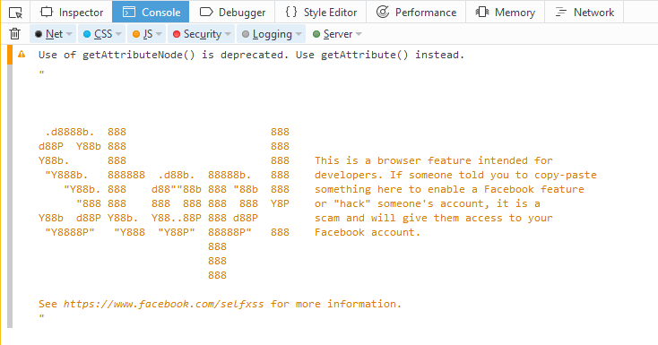

---
layout: post
title: Security
guest:  Troy Hunt
guestImage:  troy-hunt.jpg
date: 2017-07-31
audioUrl: http://traffic.libsyn.com/msdevshow/msdevshow_0163.mp3
--- 
 

### News

 - [Who Uses AWS, Who Uses Azure?](https://stackoverflow.blog/2017/07/21/trends-cloud-computing-uses-aws-uses-azure/)
 - ~~[Microsoft Paint to be killed off after 32 years](https://www.theguardian.com/technology/2017/jul/24/microsoft-paint-kill-off-after-32-years-graphics-editing-program)~~
   - [Microsoft Says Paint Isn’t Going Away But You Already Knew That](https://www.thurrott.com/windows/128081/microsoft-says-paint-isnt-going-away-already-knew)
 - [This Image Is Why Self-Driving Cars Come Loaded with Many Types of Sensors](https://www.technologyreview.com/s/608321/this-image-is-why-self-driving-cars-come-loaded-with-many-types-of-sensors/)
 - [RASPBERRY PI SIMULATOR: MICROSOFT CREATES ONLINE TOOL FOR PROTOTYPING PROJECTS](https://www.raspberrypi.org/magpi/raspberry-pi-simulator-prototype-projects-online/)
   - [Connect Raspberry Pi online simulator to Azure IoT Hub ](https://docs.microsoft.com/en-gb/azure/iot-hub/iot-hub-raspberry-pi-web-simulator-get-started)
   - [Raspberry Pi Azure IoT Online Simulator](https://azure-samples.github.io/raspberry-pi-web-simulator/)
 - [The “Million Dollar Homepage” as a Decaying Digital Artifact](https://lil.law.harvard.edu/blog/2017/07/21/a-million-squandered-the-million-dollar-homepage-as-a-decaying-digital-artifact/)

### Troy Hunt

Troy Hunt is a Microsoft Regional Director and independent security researcher.

-   [@troyhunt](https://twitter.com/troyhunt)
-   [troyhunt.com](https://www.troyhunt.com/)
-   [haveibeenpwned.com](https://haveibeenpwned.com/)
    -   [Pwned websites](https://haveibeenpwned.com/PwnedWebsites)
    -   [pastes](https://haveibeenpwned.com/Pastes)
        -   [Latest pastes](https://haveibeenpwned.com/Pastes/Latest)
    -   [API](https://haveibeenpwned.com/API/v2)

### Timezone Pick of the Week

 - [Time Zone Converter – Time Difference Calculator](https://www.timeanddate.com/worldclock/converter.html?iso=20170724T220000&p1=1244&p2=1490&p3=831)

----------------------------------------------------------------------

 - [Why ‘WannaCry’ Malware Caused Chaos for National Health Service in U.K.](http://www.nbcnews.com/news/world/why-wannacry-malware-caused-chaos-national-health-service-u-k-n760126)
 - [A cyber-invasion brought Sony Pictures to its knees](http://fortune.com/sony-hack-part-1/)
 - [SQL Injection](https://www.w3schools.com/sql/sql_injection.asp)
 - [owasp.org](https://www.owasp.org)
    -   [OWASP on Pluralsight](https://www.pluralsight.com/courses/web-security-owasp-top10-big-picture)
    -   [Top 10](https://www.owasp.org/index.php/Category:OWASP_Top_Ten_Project#tab=OWASP_Top_10_for_2017_Release_Candidate)
 - [mailinator](https://www.mailinator.com/)
 - [How did “Have I been pwned?” perform on Azure](https://www.troyhunt.com/how-did-have-i-been-pwned-perform-on/)
 - [Digital Identity Guidelines](https://pages.nist.gov/800-63-3/)
 - [Our security auditor is an idiot. How do I give him the information he wants?](https://serverfault.com/questions/293217/our-security-auditor-is-an-idiot-how-do-i-give-him-the-information-he-wants)
 - [What is Your Password?](https://www.youtube.com/watch?v=opRMrEfAIiI)
 - [Content Security Policy](https://content-security-policy.com/)
 - [Data breach disclosure 101: How to succeed after you've failed](https://www.troyhunt.com/data-breach-disclosure-101-how-to-succeed-after-youve-failed/)
    -   [Tesla's Security Vulnerability Reporting Policy](https://www.tesla.com/about/legal#security-vulnerability-reporting-policy)
 - [Inviting hackers into our homes via the internet of things](https://www.troyhunt.com/inviting-hackers-into-our-homes-via/)
 - [@internetofdongs](https://twitter.com/internetofdongs)
 - [Data from connected CloudPets teddy bears leaked and ransomed, exposing kids' voice messages](https://www.troyhunt.com/data-from-connected-cloudpets-teddy-bears-leaked-and-ransomed-exposing-kids-voice-messages/)
 - [Controlling vehicle features of Nissan LEAFs across the globe via vulnerable> APIs](https://www.troyhunt.com/controlling-vehicle-features-of-nissan/)
 - [Hack Yourself First](http://hackyourselffirst.troyhunt.com/)

