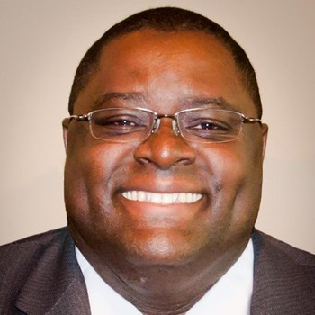
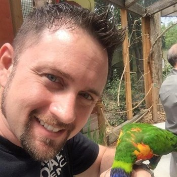
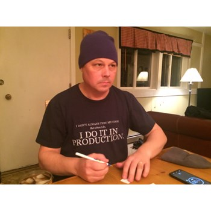

---
layout: post
title: That Conference 2017 Part 1
date: 2017-08-13
audioUrl: https://traffic.libsyn.com/msdevshow/msdevshow_0164.mp3
--- 

We're really excited to be at [ThatConference](https://www.thatconference.com/) for the **third** year in a row! Check out all the awesome speaker interviews we did this year. And Carl even has some exciting news too.

### Abbey Gwayambadde

Abbey is an Architect at Emergent Tech

 - [GitHub](https://github.com/ophedian)
 - [@ophedian](https://twitter.com/@ophedian)

------------------------------

 - [Apple CarPlay, Android Auto… That is so 2015! Come see what you can do now!](https://www.thatconference.com/Sessions/Session/11557)

### Rob Reynolds

Rob is the founder of Chocolatey Software

 - [@ferventCoder](https://twitter.com/@ferventcoder)
 - [Chocolatey](https://chocolatey.org/)
 - [ChocolateyGet](https://github.com/jianyunt/ChocolateyGet)

 ----------------------------

 - [Modern Software Management on Windows w/Chocolatey](https://www.thatconference.com/Sessions/Session/11734)
 - [Business Owners Unite!](https://www.thatconference.com/Sessions/Session/11793)

### Al Zaudtke

Al is an Architect at JJ Keller

 - [@AlZaudtke](https://twitter.com/@alzaudtke)
 - [Github](https://github.com/zaudtke)
 - [zaudtke.com](https://zaudtke.com/)

 ---------------------------

  - [KISS The forgotten Acronym](https://www.thatconference.com/Sessions/Session/10961)