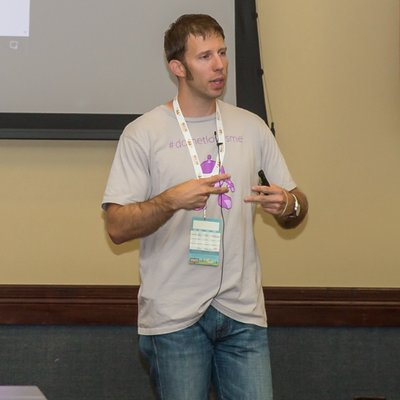

---
layout: post
episodeNumber: 165
title: That Conference 2017 Part 2
date: 2017-08-20
audioUrl: https://traffic.libsyn.com/msdevshow/msdevshow_0165.mp3
--- 

We're really excited to be at [ThatConference](https://www.thatconference.com/) for the **third** year in a row! Check out the second batch of awesome speaker interviews we did this year.

### Keith Casey

Keith is an API Problemsolver at Okta and Chief Troublemaker in Life

 - [@caseysoftware](https://twitter.com/caseysoftware)
 - [GitHub](https://github.com/CaseySoftware)

------------------------------

 - [Business Owners Unite!](https://www.thatconference.com/Sessions/Session/11793)
 - [12 Reasons Your API Sucks](https://www.thatconference.com/Sessions/Session/11666)
 - [Projects are not Products](https://www.thatconference.com/Sessions/Session/11744)

### Annie Bougie

Annie is a Senior Developer at Concurrency, Inc.

 - [@BougieFever](https://twitter.com/BougieFever)
 - [bougiefever.com](http://bougiefever.com/)

### Walt Ritscher

Walt is a Senior Staff Instructor at LinkedIn Learning

 - [@waltritscher](https://twitter.com/waltritscher)
 - [Github](https://github.com/WaltRitscher)
 - [LinkedIn](https://www.linkedin.com/in/waltritscher/)
 - [lynda.com](http://lynda.com/waltritscher)

 ---------------------------

 - [From Dull to Dazzling: How Visualization enhances data comprehension](https://www.thatconference.com/Sessions/Session/11658)

### Scott Addie

Scott is a Senior Content Developer at Microsoft

 - [@Scott_Addie](https://twitter.com/Scott_Addie)
 - [scottaddie.com](https://scottaddie.com/)
 - [Github](https://github.com/scottaddie)

 ---------------------------

 - [From Legacy MVC to Modern MVC: An ASP.NET Core Migration Path](https://www.thatconference.com/Sessions/Session/11628)

### Cecil Phillip

Cecil is a Cloud Developer Advocate for Microsoft
			
 - [@cecilphillip](https://twitter.com/cecilPhillip)
 - [cecilphillip.com](http://cecilphillip.com/)
 - [Away from the Keyboard Podcast](http://awayfromthekeyboard.com/)
 - [GitHub](https://www.thatconference.com/images/icons/btn-s-gh.png)

 ---------------------------

 - [(Micro)Service Discovery Patterns with ASP.NET Core](https://www.thatconference.com/Sessions/Session/11478)