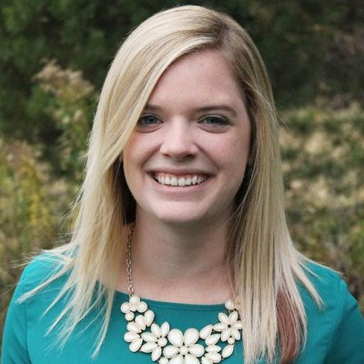
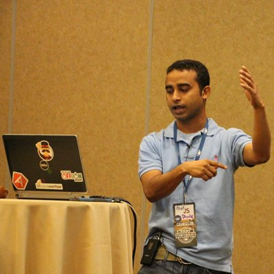

---
layout: post
episodeNumber: 166
title: That Conference 2017 Part 3
date: 2017-08-27
audioUrl: https://static.msdevshow.com/episodes/msdevshow_0166.mp3
--- 

We're really excited to be at [ThatConference](https://www.thatconference.com/) for the **third** year in a row! Check out the final batch of awesome speaker interviews we did this year.

### Rachel Krause

Rachel is a User Experience Engineer at Concurrency, Inc.

 - [@rachelkrau](https://twitter.com/rachelkrau)
 - [rachelkrau.com](http://www.rachelkrau.com/)
 - [MKE .NET](http://www.mkedotnet.com/)

------------------------------

 - [Think Outside the Jumbotron: Choosing a CSS Framework](https://www.thatconference.com/Sessions/Session/11125)

### John Kerr

John is *THAT* JS Dude. You know the one.

 - [@jsdude005](https://twitter.com/jsdude005)
 - [thatjsdude.com](http://www.thatjsdude.com/)

### Dustin Ewers

Dustin is a web developer at Centare.

 - [@DustinJEwers](https://twitter.com/DustinJEwers)
 - [Github](https://github.com/DustinEwers)
 - [LinkedIn](https://www.linkedin.com/in/dustinewers/)

 ---------------------------

 - [R: It's Not Just For Pirates Anymore](https://www.thatconference.com/Sessions/Session/10957)

### Danny Warren

Danny is a Software Craftsman at Pluralsight.

 - [@dannydwarren](https://twitter.com/dannydwarren)
 - [Blog](https://dannydwarren.github.io/)
 - [Github](https://github.com/dannydwarren)

 ---------------------------

 - [Hey, Cortana! Where am I?](https://www.thatconference.com/Sessions/Session/6989)
