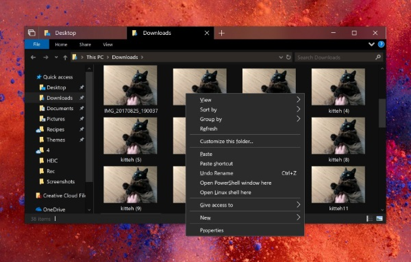

---
layout: post
episodeNumber: 195
title: The latest in Teams
guest: Andrew Bybee and Larry Jin
guestImage: larry-and-andrew.jpg
date: 2018-06-25
audioUrl: https://traffic.libsyn.com/msdevshow/msdevshow_0195.mp3
--- 

### News

 - [A slower speed of might -- An MIT game](http://gamelab.mit.edu/games/a-slower-speed-of-light/)
    - A Slower Speed of Light is a first-person game prototype in which players navigate a 3D space while picking up orbs that reduce the speed of light in increments
 - [Announcing Microsoft Research Open Data – Datasets by Microsoft Research now available in the cloud](https://www.microsoft.com/en-us/research/blog/announcing-microsoft-research-open-data-datasets-by-microsoft-research-now-available-in-the-cloud/)
    - [Microsoft Open Data](http://microsoftopendata.com/)
 - [fuget.org](https://www.fuget.org/)
 - [Microsoft acquires GitHub](https://blogs.microsoft.com/blog/2018/06/04/microsoft-github-empowering-developers/)

### Andrew Bybee

Andrew is a Project Manager working on the Teams developer platform

 - [Channel 9](https://channel9.msdn.com/Events/Speakers/Andrew-Bybee)
 - [LinkedIn](https://www.linkedin.com/in/andrew-bybee-813565)

### Larry Jin

Larry is a Project Manager working on the Teams developer platform

 - [LinkedIn](https://www.linkedin.com/in/elj4y/)

-----------------------------------------------------  

 - [Teams for education](https://education.microsoft.com/courses-and-resources/resources/meet-microsoft-teams)
 - [Office 365 Connectors for Microsoft Teams](https://docs.microsoft.com/en-us/microsoftteams/platform/concepts/connectors)
 - [Microsoft adds new app integrations, app store to Teams](https://www.zdnet.com/article/microsoft-adds-new-app-integrations-app-store-to-teams/)
 - [Build and manage tailored apps for the enterprise using the Teams developer platform](https://techcommunity.microsoft.com/t5/Microsoft-Teams-Blog/Build-and-manage-tailored-apps-for-the-enterprise-using-the/ba-p/190580)
 - [New ways to use apps and get more done in Microsoft Teams](https://www.microsoft.com/en-us/microsoft-365/blog/2018/01/29/new-ways-to-use-apps-and-get-more-done-in-microsoft-teams/)
 - [Use the Microsoft Graph API to work with Microsoft Teams](https://developer.microsoft.com/en-us/graph/docs/api-reference/beta/resources/teams_api_overview)
 - [Quickly develop apps with App Studio for Microsoft Teams](https://docs.microsoft.com/en-us/microsoftteams/platform/get-started/get-started-app-studio)
 - [What programming language was MS Teams built with?](https://techcommunity.microsoft.com/t5/Microsoft-Teams-AMA/What-programming-language-was-MS-Teams-built-with/td-p/28786)
 - [AppSource](https://appsource.microsoft.com/en-us/)
 - [Enterprise Connect](https://www.enterpriseconnect.com/)

### Azure Pick of the Week

 - [Auto-Destroy Azure resources -- and more](https://github.com/noelbundick/azure-cli-extension-noelbundick/)
    - You ever wish you could create something in Azure and have it automatically go away in X hours or days? I give you self-destruct mode! `az group create -n foo -l eastus --self-destruct 2h`

### Dev Tips of the Week

 - [GraphQL plugin for Visual Studio Code](https://www.prisma.io/blog/vscode-thieghu7shoo/)
    - Intelligent autocompletion
    - Jump-to-definition
    - Validate queries against your GraphQL schema
 - If you've installed \#WSL there's now a "Open Linux shell here" option when you shift+right-click a folder or whitespace in Windows File Explorer 
    - 