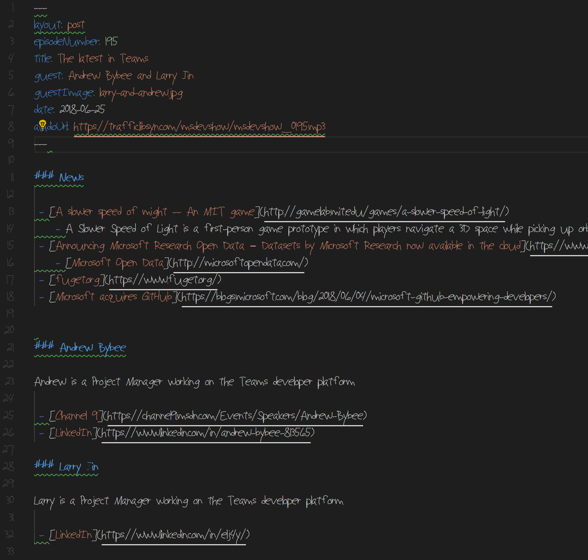

---
layout: post
episodeNumber: 196
title: Bots Experience
guest: Michael Szul
guestImage: michael-szul.jpg
date: 2018-07-03
audioUrl: https://static.msdevshow.com/episodes/msdevshow_0196.mp3
--- 

### News

 - [Apple Launches Repair Program for Faulty MacBook and MacBook Pro Keyboards](https://www.macrumors.com/2018/06/22/apple-macbook-pro-keyboard-repair-program/)
    - [Apple Engineers Its Own Downfall With the Macbook Pro Keyboard](https://ifixit.org/blog/10229/macbook-pro-keyboard/)
 - [Azure IoT Edge is now generally available](https://azure.microsoft.com/en-us/blog/azure-iot-edge-generally-available-for-enterprise-grade-scaled-deployments/)
 - Windows Command Line
    - [Background](https://blogs.msdn.microsoft.com/commandline/2018/06/20/windows-command-line-backgrounder/)
    - [Evolution of Command Line](https://blogs.msdn.microsoft.com/commandline/2018/06/27/windows-command-line-the-evolution-of-the-windows-command-line/)
 - Question for the Audience: What's your preferred bag to carry a laptop and why?
    - [Code10 bags](https://code10bags.com/)
    - [Tom Bihn](https://www.tombihn.com/collections/laptop-bags/products/synapse-25?variant=50297911815)
 - [O365 Business Premium](https://products.office.com/en-US/compare-all-microsoft-office-products?tab=2)

### Michael Szul 

Michael is the Principal Software Engineer at the University of Virginia, School of Medicine. He is a blogger, podcaster, open source contributor, and a Microsoft MVP. He lives in Virginia with his wife, who is in the process of raising their 3 year old twins... much harder than programming."

 - [@szul](https://twitter.com/szul)
 - [Microsoft MVP Profile](https://mvp.microsoft.com/en-us/PublicProfile/5002839)
 - [michael.szul.us](http://michael.szul.us/)
 - [LinkedIn](https://www.linkedin.com/in/mjszul/)
 - [codepunk.io](https://codepunk.io/)

---------------------------------------------------------------

 - [Bot Framework](https://dev.botframework.com/)
 - [LUIS](https://www.luis.ai/home)
 - [James Whittaker (Microsoft) on Our uncertain future with our robot overlords | TNW Conference 2018](https://www.youtube.com/watch?v=__BFCICoIDc&t=3s&index=28&list=LLJHJVh8WIoWze_hjNACsG5A)
 - [Chatdown](https://github.com/Microsoft/botbuilder-tools/tree/master/Chatdown)
    - [Chatdown for the Bot Framework](https://codepunk.io/chatdown-for-the-bot-framework-introduction-and-processing-multiple-files/)
 - [Why Aren't Students Showing Up For College?](https://www.npr.org/2017/07/17/537740926/why-arent-students-showing-up-for-college)
 - [QNA Maker](https://www.qnamaker.ai/)
 - [Microsoft Conversational AI tools enable developers to build, connect and manage intelligent bots](https://azure.microsoft.com/en-us/blog/microsoft-conversational-ai-tools-enable-developers-to-build-connect-and-manage-intelligent-bots/)
 - [Bot Framework experts on Twitter](https://twitter.com/szul/lists/bot-framework/members)

### Azure Pick of the Week

 - [Static website hosting for Azure Storage now in public preview](https://azure.microsoft.com/en-us/blog/azure-storage-static-web-hosting-public-preview/)
    - [Configure a custom domain name for your Azure Storage account](https://docs.microsoft.com/en-us/azure/storage/blobs/storage-custom-domain-name)
    - [Using the Azure CDN to access blobs with custom domains over HTTPS](https://docs.microsoft.com/en-us/azure/storage/blobs/storage-https-custom-domain-cdn)

### App of the Week

 - [qit.cloud ](https://qit.cloud)
 - [Microsoft Font Maker](https://www.microsoft.com/store/productId/9N9209F8S3VC)
    - 