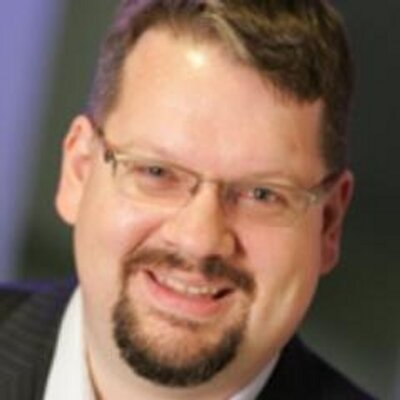
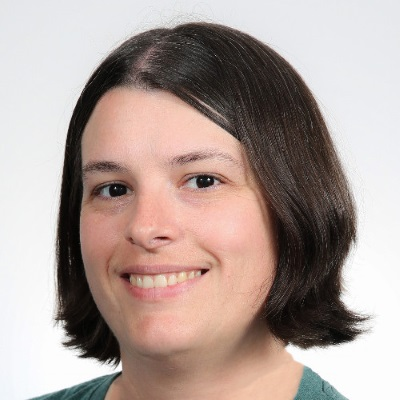
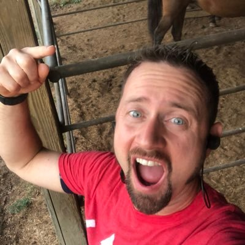
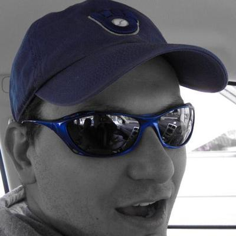

---
layout: post
episodeNumber: 201
title: That Conference 2018 Part 2
date: 2018-08-18
audioUrl: https://traffic.libsyn.com/msdevshow/msdevshow_0201.mp3
--- 

### That Conference 2018

As always, That Conference has an amazing conference to go to. While we highly recommend it, if you can't make it, check out conferences that are local to you. The ability to learn about technology as well as network with like-minded people is always a blast, as well as something that helps you stand out at work.

### Richard Campbell

 - [@RichCampbell](https://twitter.com/RichCampbell)
 - [runasradio.com](http://www.runasradio.com/)
 - [dotnetrocks.com](http://www.dotnetrocks.com/)
 - [hbox.org](http://www.htbox.org/)
 - [devintersection.com](http://www.devintersection.com/)
 - [Regional Director](https://rd.microsoft.com/en-us/richard-campbell)
 - [Microsoft MVP](https://www.mvp.microsoft.com/en-us/PublicProfile/10953?fullName=Richard%20%20Campbell)

### Kim Cwiak

 - [@devfables](https://twitter.com/devfables)
 - [devfables.com](http://devfables.com/)

### Rob Reynolds

 - [@ferventcoder](https://twitter.com/ferventcoder)
 - [chocolatey.com](http://chocolatey.com/)
 - [chocolateyfest.com ](https://chocolateyfest.com/)
 - [aka.ms/devsetup](http://aka.ms/devsetup)

Michael Fazio

 - [@faziodev](https://twitter.com/faziodev)  
 - [That Conference ](https://www.thatconference.com/speakers/speaker/MFazio23)