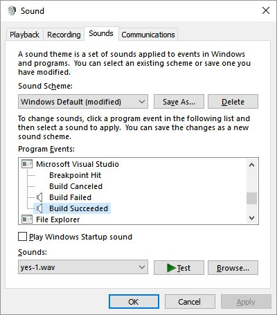

### News

 - [Introducing the Windows Internals Series: One Windows Kernel](https://insider.windows.com/en-us/articles/category/article-categories/windows-internals/)
   - [One Windows Kernel](https://techcommunity.microsoft.com/t5/Windows-Kernel-Internals/One-Windows-Kernel/ba-p/267142)
 - [Introducing GitHub Actions](https://css-tricks.com/introducing-github-actions/)
   - [GitHub Actions](https://github.com/features/actions)

### Neeraj Joshi

Neeraj is a random awesome dude at Microsoft!

Check out Neeraj at [neeraj.joshi@microsoft.com](mailto:Neeraj.joshi@microsoft.com?subject=You%20were%20Awesome%20on%20the%20MS%20Dev%20Show) -- the **original** social network

### Ignite 2018

Check out the [Ignite 2018 News Guide](IGNITEBOOKOFNEWS-2018.pdf) for more tech topics.
 
 - Data
   - Azure Data Box
     - Edge
     - Heavy - 1 petabyte of storage capacity
     - Gateway - IoT Edge integrated
   - SQL Server 2019
     - built-in Spark and Hadoop distributed file system
   - Azure Data Explorer
   - CosmosDB
     - Multi-master
     - Cassandra API
     - Reserved Capacity
   - SQL Managed instance
 - IoT
   - Digital twins public preview
   - Edge has public module marketplace
   - Azure Sphere dev kits available
 - Azure & Windows
   - Windows Server 2019 GA Oct
   - Ultra SSD
     - Up to 64TB size
     - Up to 160k IOPs
   - Premium files (SSD)
   - Front Door Service
     - Understands http and can help with routing
   - ExpressRoute Direct
     - 100gbps
   - Azure Blueprints
     - Managing and assigning deployment templates?
     - Versioning
     - Part of Azure Governance
   - Functions V2
   - Quantum to add chemical simulation
   - Windows Virtual Desktop
   - Microsoft Learn
 - Azure Stack
   - Kubernetes on Stack
 - Security
   - Going Password free
 - Other
   - Stream mobile app with offline viewing
   - OneDrive "Files on demand" for Mac
    
### Dev Tip of the Week

 From [Steve Smith @ardalis](https:/twitter.com/ardalis) on [Twitter](https://twitter.com/ardalis/status/1051888353451417600/photo/1)

Add sound effects to Visual Studio Build fail and success from the Sound Control Panel. Also Breakpoint Hit and Build Canceled!

