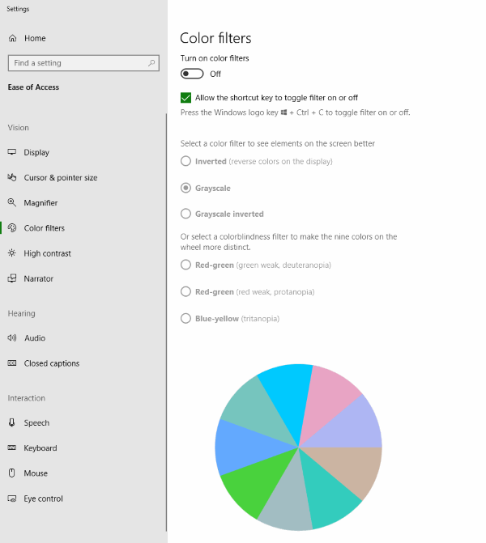

---
layout: post
episodeNumber: 205
title: Service Fabric and Mesh
guest: Mark Fussell
guestImage: mark-fussell.jpg
date: 2018-10-30
audioUrl: https://traffic.libsyn.com/msdevshow/msdevshow_0205.mp3
--- 

### News

 - [theuserisdrunk.com](https://theuserisdrunk.com/)
 - [Human competitive patches in automatic program repair with repairnator](https://medium.com/@martin.monperrus/human-competitive-patches-in-automatic-program-repair-with-repairnator-359042e00f6a)
    - [A bot has been finding bugs and submitting patches for them, successfully masquerading as a human](https://boingboing.net/2018/10/19/repairnator-is-everywhere.html)
    - [Researchers secretly deployed a bot that submitted bug fixing pull requests](https://developers.slashdot.org/story/18/10/20/039214/researchers-secretly-deployed-a-bot-that-submitted-bug-fixing-pull-requests)
 - [AI vs. Lawyers the Ultimate Showdown](https://www.lawgeex.com/AIvsLawyer.html)
    - [20 top lawyers were beaten by legal AI. Here are their surprising responses](https://hackernoon.com/20-top-lawyers-were-beaten-by-legal-ai-here-are-their-surprising-responses-5dafdf25554d)
 - [Pull request successfully merged. Starting build...](https://blog.github.com/2018-10-26-github-and-microsoft/)

### Mark Fussell

 - [@mfussell](https://twitter.com/mfussell)
 - [@servicefabric](https://twitter.com/servicefabric)
 - [LinkedIn](https://www.linkedin.com/in/mfussell/)
 - [Blog](https://azure.microsoft.com/en-us/blog/author/mfussell/)
 - [GitHub](https://github.com/msfussell)

-------------------------------------------------------------------------------

-   [Service Fabric](https://azure.microsoft.com/en-us/services/service-fabric/)
-   [Service Fabric for Windows Service](https://docs.microsoft.com/en-us/azure/service-fabric/service-fabric-cluster-creation-for-windows-server)
-   [Cluster creation](https://docs.microsoft.com/en-us/azure/service-fabric/service-fabric-cluster-creation-via-portal)
-   [Service Fabric Mesh](https://docs.microsoft.com/en-us/azure/service-fabric-mesh/service-fabric-mesh-overview)
    -   [Quick start](https://docs.microsoft.com/en-us/azure/service-fabric-mesh/service-fabric-mesh-quickstart-deploy-container)
-   [What is ARM?](https://mitchdenny.com/what-is-azure-resource-manager/)
-   [Envoy](https://github.com/envoyproxy/envoy/)
-   [Service Fabric IoT backend example](https://azure.microsoft.com/en-us/resources/samples/service-fabric-dotnet-iot/)
    -   [GitHub](https://github.com/Azure-Samples/service-fabric-dotnet-iot)
-   [Build 2018 - BRK2508 Inside Azure Datacenter Architecture with Mark Russinovich](https://mybuild.microsoft.com/sessions?p1=eyJzcGVha2VyIjpbXSwidGltZXNsb3QiOltdLCJkYXkiOltdLCJyb29tIjpbXSwibG9jYXRpb24iOltdLCJzdGFydCI6IiIsImZpbmlzaCI6IiIsInBhZ2VudW1iZXIiOjEsImNhdGVnb3JpZXMiOnt9LCJrZXl3b3JkIjoiQlJLMjUwOCJ9)

### Dev Tip of the Week

 - In Latest version of Windows 10 - Win + CTRL + C wasn't working
 - In Windows Settings search for **color filters** to enable also control Greyscale and Colorblind friendly filters

