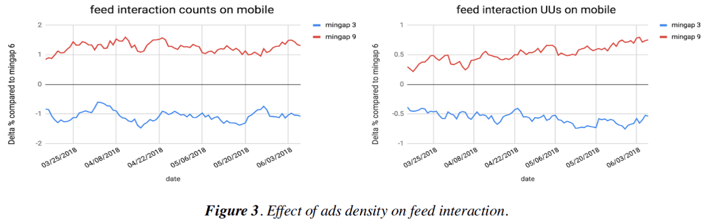

---
layout: post
episodeNumber: 216
title: Cloud Native Computing Foundation 
guest: Alessandro Vozza
guestImage: alessandro-vozza.jpg
date: 2019-03-30
audioUrl: https://traffic.libsyn.com/msdevshow/msdevshow_0216.mp3
--- 

### News

 - [DTrace on Windows](https://techcommunity.microsoft.com/t5/Windows-Kernel-Internals/DTrace-on-Windows/ba-p/362902)
    - [Open DTrace on GitHub](https://github.com/opendtrace)
    - [Dynamic Tracing Guide](http://dtrace.org/guide/preface.html)
    - [DTrace on Windows Branch](https://github.com/opendtrace/opendtrace/tree/windows)
 - [Ads cost you 10% of your users](https://twitter.com/gwern/status/1103855323100708866)
    - [Pandora Learns the Cost of Ads and of Subscruptions](https://www.wired.com/story/pandora-learns-the-cost-of-ads-and-of-subscriptions/)
    - [Mozilla Research: The Effect of Ad Blocking on User Engagement with the Web](https://research.mozilla.org/files/2018/04/The-Effect-of-Ad-Blocking-on-User-Engagement-with-the-Web.pdf)
    - LinkedIn Charts:
    - 
 - [My Salary Progression in Tech](https://georgestocker.com/2019/03/14/my-salary-progression-in-tech/)
    - Form: [http://msdv.sh/AnonymousPayForm](http://msdv.sh/AnonymousPayForm)
    - Results: [http://msdv.sh/AnonymousPayResults](http://msdv.sh/AnonymousPayResults)

### Allesandro Vozza 

Alessandro works in Commercial Software Engineering at Microsoft. He's also a community organizer and participant, and an ambassador for the Cloud Native Computing Foundation.

 - [@bongo](https://twitter.com/bongo)
 - [LinkedIn](https://www.linkedin.com/in/alessandrovozza)
 - [GitHub](https://github.com/ams0/)

-------------------------------------------------------------------

 - [cncf.io](https://www.cncf.io/)
 - [Members](https://www.cncf.io/about/members/)
 - [Ambassadors](https://www.cncf.io/people/ambassadors/)
 - [CNCF Github](https://github.com/cncf)
 - [Graduation Criteria](https://github.com/cncf/toc/blob/master/process/graduation_criteria.adoc)
 - [Kubecon Events](https://www.cncf.io/community/kubecon-cloudnativecon-events/)
 - [Technical Oversight Committee](https://www.cncf.io/people/technical-oversight-committee/)
 - [CNCF Landscape](https://landscape.cncf.io/)