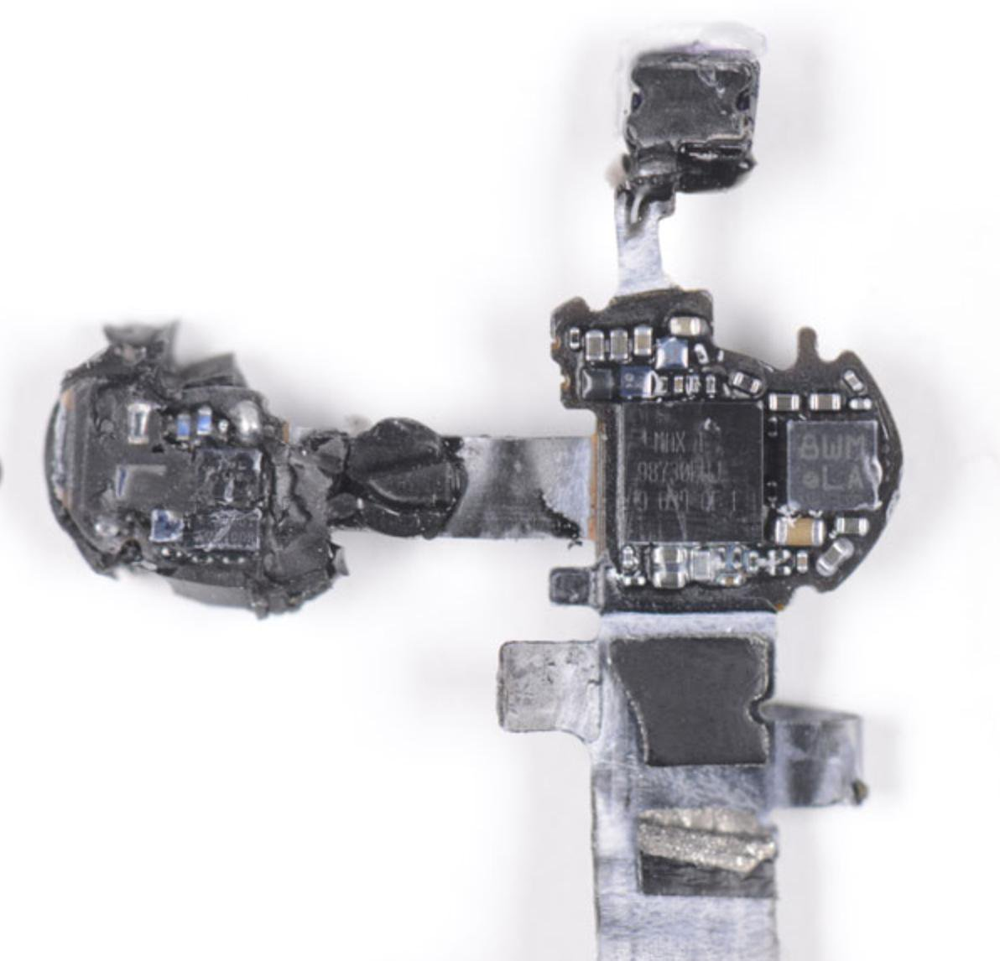

---
layout: post
episodeNumber: 218
title: Careers
guest: Jeremy Likness
guestImage: jeremy-likness.jpg
date: 2019-05-06
audioUrl: https://traffic.libsyn.com/msdevshow/msdevshow_0218.mp3
ignore: true
--- 

### News

 - [VS Code Remote Extensions](https://marketplace.visualstudio.com/items?itemName=ms-vscode-remote.vscode-remote-extensionpack)
    - Dev environments for node,
 python, go, java, dotnetcore, php, rust, cpp
 - [The inception bar: a new phishing method](https://jameshfisher.com/2019/04/27/the-inception-bar-a-new-phishing-method/)
 - [WASI: A system interface to run WebAssembly outside the web](https://hacks.mozilla.org/2019/03/standardizing-wasi-a-webassembly-system-interface/)
 - [Apple AirPods H1 chip (SOCs) has the processing power of an iPhone 4—in each ear](https://twitter.com/BrianRoemmele/status/1108450783865913344/photo/1)
     - Class 1 Bluetooth 5. 
     - H1 die size is ~12mm2. 
     - Parts: 
        - H1 Cypress SoC 
        - Maxim audio codec 
        - Bosch BMA280 accelerometer 
        - STM 3 axis accelerometer 
        - STM regulator 
        - TI data converter 
        - Goertek MEMs microphones
 - 

### Jeremy Likness 

Jeremy Likness is a Cloud Advocate at Microsoft, and has been a professional developer for 25 years.

 - [@jeremylikness](https://twitter.com/jeremylikness)
 - [blog.jeremylikness.com](https://blog.jeremylikness.com)

----------------------------------------------------------------------------

 - [Hack your Career part 1](https://blog.jeremylikness.com/hack-your-career-part-one-of-two-b0c25ef9d58f)
 - [Hack your Career part 2](https://blog.jeremylikness.com/hack-your-career-part-two-of-two-d1f0e5542553)
 - [Hack your signal to noise ratio](https://medium.com/that-conference/raise-your-signal-to-noise-ratio-333ebc8ec49d)