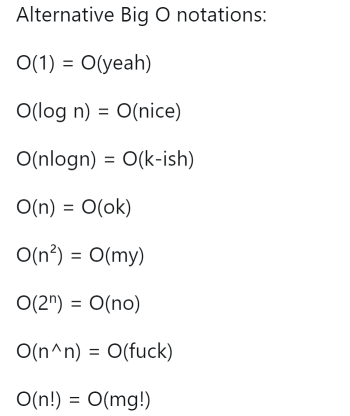

---
layout: post
episodeNumber: 228
title: Open Sourcing the Windows Calculator
guest: Dave Grochocki and Howard Wolosky
guestImage: dave-and-howard.jpg
date: 2019-08-01
audioUrl: https://static.msdevshow.com/episodes/msdevshow_0228.mp3
--- 

### News

 - [Technician keeps computer made in 1959 still humming along](http://www.asahi.com/ajw/articles/AJ201907280007.html)
    - [FACOM 128A and 128B Relay Computers](http://museum.ipsj.or.jp/en/computer/dawn/0012.html)
    - [Raspberry Pi Zero vs Elliott 405](https://www.spinellis.gr/blog/20151129/)
 - [New US bill would ban autoplay videos and endless scrolling](https://www.theverge.com/2019/7/30/20746878/josh-hawley-dark-patterns-platform-design-autoplay-youtube-videos-scrolling-snapstreaks-illegal)
 - [Raspberry Pi admits to faulty USB-C design on the Pi 4](https://arstechnica.com/gadgets/2019/07/raspberry-pi-4-uses-incorrect-usb-c-design-wont-work-with-some-chargers/)
 - [Advancing Microsoft Azure reliability](https://azure.microsoft.com/en-us/blog/advancing-microsoft-azure-reliability/)
 - [Alternative Big O notations](https://twitter.com/PPathole/status/1155464941177987072)
 - 
 - [Book of News Build 2019](https://news.microsoft.com/wp-content/uploads/prod/sites/558/2019/05/FINAL-Book-of-News-Build-2019-5.6.19-2.pdf)

### Dave Grochocki 

David Grochocki is a Senior Program manager at Microsoft working in the app space focusing on user experience.

 - [@dgrochocki](https://twitter.com/dgrochocki)
 - [GitHub](https://github.com/grochocki)

### Howard Wolosky

Howard Wolosky is a Senior Engineer at Microsoft for the past 18 years, working on VS, Windows Phone, and is now working across the first party apps built into windows.

 - [@QuackFu](https://twitter.com/QuackFu)
 - [GitHub](https://github.com/HowardWolosky)

----------------------------------------------

 - [Calculator](http://aka.ms/calculator)
 - [Make this app immune against any exploit](https://github.com/Microsoft/calculator/pull/101)
 - [Abacus mode](https://github.com/Microsoft/calculator/issues/261)
 - [Add Graphing Mode](https://github.com/microsoft/calculator/issues/338)