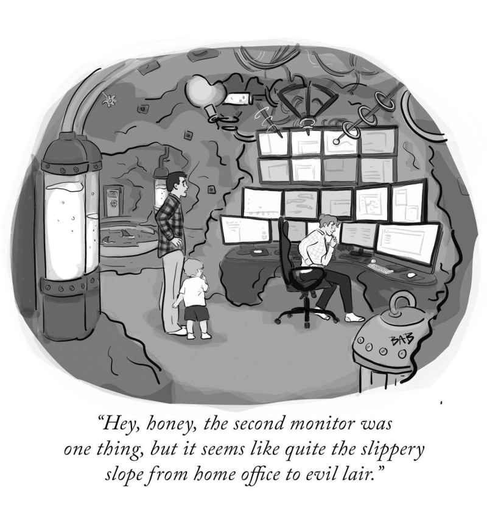

---
layout: post
episodeNumber: 241
title: Ultimate Home Office
date: 2020-08-24
audioUrl: https://traffic.libsyn.com/msdevshow/msdevshow_0241.mp3
--- 

### News

 - Microsoft Flight Simulator
    - [Vertical cars and other bugs](https://twitter.com/JanelleCShane/status/1296528940652265472)
    - [212 story building bug in Austrailia](https://www.engadget.com/flight-simulator-open-street-map-building-205545509.html?guccounter=1&guce_referrer=aHR0cHM6Ly93d3cuYmluZy5jb20v&guce_referrer_sig=AQAAACPCLJKNHfQ2omDlaC3V1Ib-snTDaz-JC_zLWVbZFKmX3kyY9yQkKeqlUbNtIUQ0-0bA7eeksPpwMAQdgb04nCLR1VVVzX_vTnF9h3V_FnC8aenH1eD_L57tmTzJW3WnDpF40u-szOrp9-Dt471QwYOUBNnJOP2fCuoVNvc1NHHp)
 - [Mailto: Links can automatically add file attachments to an email, and why that is bad](https://twitter.com/jensvoid/status/1295357952480751616)
 - [Clear Channel’s billboards will start tracking consumers in Europe](https://www.theverge.com/2020/8/10/21361734/clear-channel-billboards-privacy-ad-tracking-europe)
 - [Backblaze Hard Drive Stats Q2 2020](https://www.backblaze.com/blog/backblaze-hard-drive-stats-q2-2020/)
 - [The software industry is amazingly young. Let's look at it from a different point of view.](https://twitter.com/isotopp/status/1287277306441011201)
 - [Facebook account now required to login to Oculus devices](https://www.oculus.com/blog/a-single-way-to-log-into-oculus-and-unlock-social-features/)

### Ultimate Home Office

 - [Uplift Desk](https://www.upliftdesk.com/) - Not a sponsor! Both of us now have a version of these great desks.
 - Wire Management
     - [Cable Management Sleeve](https://amzn.to/31wg3MZ)
     - [Desktop Power Grommet](https://amzn.to/3gCJq4u)
 - [Invisible under-desk charger](https://www.mockett.com/wcs4-95.html)
 - Wall Decorations
     - [Nanoleaf Wall Lights](https://nanoleaf.me/en/)
     - [Cloud LED Light](https://amzn.to/3joQT9j)
     - [Heart LED Light](https://amzn.to/2FVgjwC)
 - Lighting
   - [Ikea GRÖNÖ](https://www.ikea.com/us/en/p/groenoe-table-lamp-with-led-bulb-frosted-glass-white-70424982/) - Great lamp for ambient light.
   - [Lampat LED Desk Lamp](https://www.amazon.com/gp/product/B00KSQ8ZNA/) - LED, dimmable, and can adjust color or warmth of the light. Excellent task lighting.
