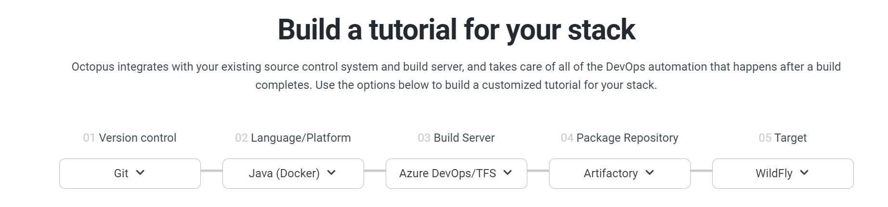

---
layout: post
episodeNumber: 242
title: Octopus Deploy
guest: Michael Levan
guestImage: michael-levan.jpg
date: 2020-10-26
audioUrl: https://traffic.libsyn.com/msdevshow/msdevshow_0242.mp3
--- 

### News

 - [Building an invisible PC](https://www.youtube.com/watch?v=Perqf0dOGLk) \[YouTube Link\]
 - [Debug Visualizer for VS Code](https://github.com/hediet/vscode-debug-visualizer/tree/master/extension)
 - [Introducing the half type in .NET 5](https://devblogs.microsoft.com/dotnet/introducing-the-half-type/)
 - [Snake in a QR code](https://itsmattkc.com/etc/snakeqr/)
 - [What's in a digital pregnancy test?](https://twitter.com/Foone/status/1301707401024827392?s=19) \[Twitter thread\]
 - [Microsoft's underwater data centre resurfaces after two years](https://www.bbc.com/news/technology-54146718)

### Octopus Deploy

 - [Octopus Deploy Blog](https://octopus.com/blog)
 - [hcl](https://github.com/hashicorp/hcl#hcl)
 - [Roadmap](https://octopus.com/company/roadmap)

### Michael Levan

Michael Levan is a Developer Advocate at Octopus Deploy and the author of "[Quality Code with Go](https://sunny-founder-2382.ck.page/d9703d3454)", available on Gumroad. He's a lover of all things Go, Python, Docker,  Kubernetes, and code quality.

 - [@thenjdevopsguy](https://twitter.com/thenjdevopsguy)
 - [clouddev.engineering](https://www.clouddev.engineering/)
 - [CloudDev.Engineering on YouTube](https://www.youtube.com/clouddevengineering)
 - [GitHub](https://github.com/AdminTurnedDevOps)
 - [Head in the Clouds podcast](https://headintheclouds.libsyn.com/)
 - [Quality Code with Go (eBook)](https://sunny-founder-2382.ck.page/d9703d3454)